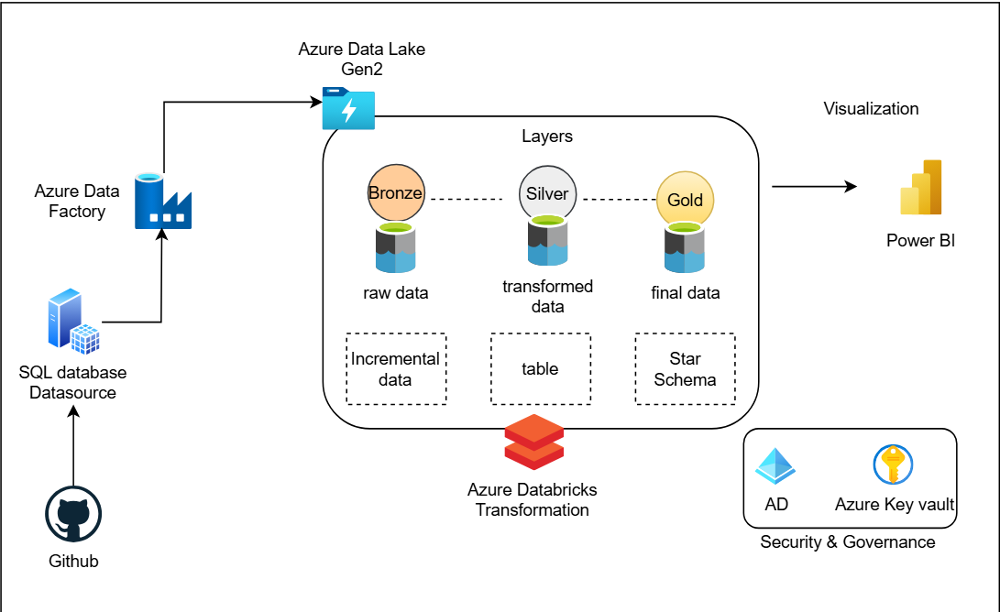
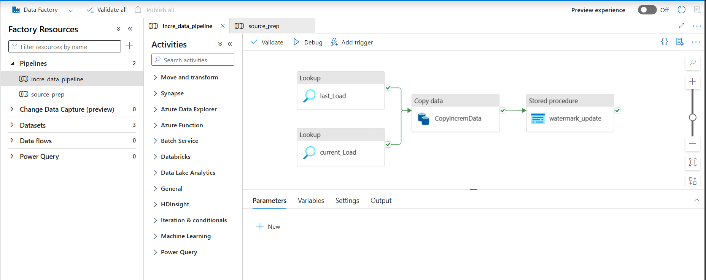
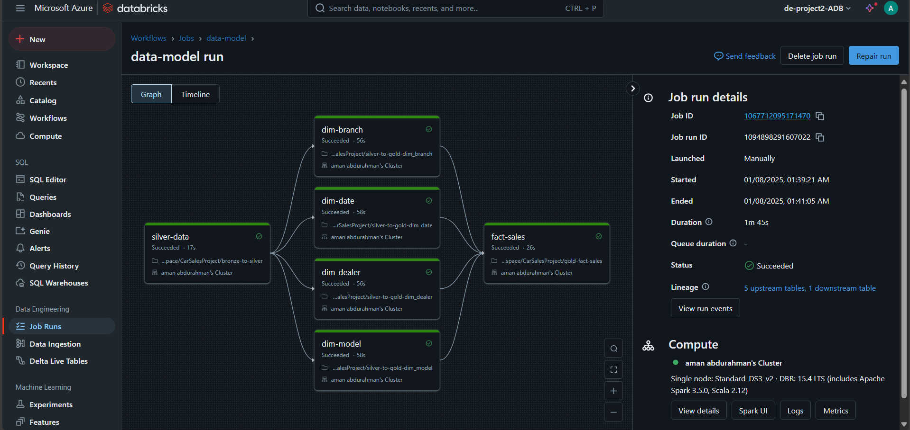
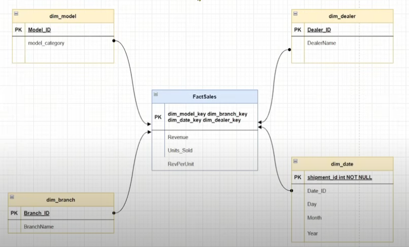

# Azure Data Engineering Project - Car Sales Data Pipeline

## Overview

This End-to-End Data Engineering Project demonstrates a comprehensive data pipeline for car sales data using Azure cloud services. The project implements a Medallion architecture (Bronze-Silver-Gold) with incremental data loading, Slowly Changing Dimensions (SCD Type-1), and star schema design to transform raw data into analytical-ready insights.

**Key Features:**
- Incremental data ingestion from source to Azure SQL Database
- Medallion architecture implementation in Azure Data Lake Gen2
- Data transformation using Azure Databricks with PySpark
- Star schema design with fact and dimension tables
- SCD Type-1 implementation for dimension tables
- Delta Lake format for ACID transactions and data versioning

## Prerequisites

- Basic Knowledge on SQL and Python/PySpark
- Azure Account
- Good to have basic understanding about Azure Services (ADF, databricks, data lake)

## Tools/Technologies Used

- **Azure SQL Database** - Raw data storage from source
- **Azure Data Factory (ADF)** - ETL/ELT pipeline orchestration and incremental data loading
- **Azure Databricks** - Data transformation using PySpark
- **Azure Data Lake Gen2 (ADLS)** - Multi-layer data storage (Bronze, Silver, Gold)
- **Delta Lake** - ACID transactions and data versioning
- **PySpark** - Distributed data processing and transformation
- **SQL** - Data querying and analysis 

## Project Structure

```
├── README.md
├── Databricks-Notebook/           # Databricks notebooks and Python scripts
│   ├── DB-Notebook.ipynb         # Main data processing notebook
│   ├── Silver_nb.ipynb           # Silver layer transformation notebook
│   ├── Gold-dim_branch.py        # Branch dimension table creation
│   ├── Gold-dim_date.py          # Date dimension table creation
│   ├── Gold-dim_dealer.py        # Dealer dimension table creation
│   ├── Gold-dim_model.py         # Model dimension table creation
│   └── gold-fact-sales.py        # Fact table creation and star schema
├── Diagrams-ScreenShot/          # Architecture diagrams and screenshots
│   ├── architecture.png          # Overall solution architecture
│   ├── etl_pipeline.png          # ETL pipeline visualization
│   ├── etl2.png                  # Additional pipeline diagram
│   └── star_schema.png           # Star schema design
└── Source-Dataset/               # Sample data files
    ├── SalesData.csv             # Initial car sales dataset
    └── IncrementalSales.csv      # Incremental data for testing

```

## Data Architecture



### Data Flow:
1. **Source Data** - Car sales data stored in CSV files
2. **Ingestion Layer** - Azure Data Factory handles incremental data loading into Azure SQL Database
3. **Bronze Layer** - Raw data stored in Parquet format in ADLS Gen2
4. **Silver Layer** - Cleaned and transformed data with business logic applied
5. **Gold Layer** - Star schema implementation with fact and dimension tables optimized for analytics

### Medallion Architecture Implementation:
- **Bronze Layer**: Raw data ingestion from SQL Database to ADLS (Parquet format)
- **Silver Layer**: Data cleansing, transformation, and business rule application
- **Gold Layer**: Star schema with dimension tables (Branch, Date, Dealer, Model) and fact table (Sales)

## Pipeline Visualization





## Star Schema Design



### Dimension Tables:
- **dim_branch** - Branch information with SCD Type-1 implementation
- **dim_date** - Date dimension for time-based analysis
- **dim_dealer** - Dealer information with incremental loading
- **dim_model** - Car model details and categorization

### Fact Table:
- **fact_sales** - Core sales metrics (Revenue, Units_Sold, RevenuePerUnit) with foreign keys to all dimensions

## Key Features Implemented

### 1. Incremental Data Loading
- Automated detection of new and changed records
- Efficient data pipeline that processes only delta changes
- Configurable incremental flags for dimension processing

### 2. Slowly Changing Dimensions (SCD Type-1)
- Automatic handling of dimension updates
- Surrogate key generation for new records
- MERGE operations using Delta Lake for UPSERT functionality

### 3. Data Transformations
- **Silver Layer**: Added calculated columns (Model_Category, RevenuePerUnit)
- **Gold Layer**: Implemented star schema with proper normalization
- **Data Quality**: Ensured referential integrity between fact and dimension tables

### 4. Delta Lake Integration
- ACID transaction support
- Schema evolution capabilities
- Time travel and data versioning

## Databricks Notebooks

### Bronze to Silver Transformation (`Silver_nb.ipynb`)
- Reads Parquet files from Bronze layer
- Applies data transformations and business logic
- Creates calculated columns (Model_Category, RevenuePerUnit)
- Writes cleaned data to Silver layer

### Gold Layer Dimension Tables
- **`Gold-dim_branch.py`** - Creates and maintains branch dimension with SCD Type-1
- **`Gold-dim_date.py`** - Builds date dimension for time-based analysis
- **`Gold-dim_dealer.py`** - Manages dealer dimension with incremental loading
- **`Gold-dim_model.py`** - Handles car model dimension and categorization

### Fact Table Creation (`gold-fact-sales.py`)
- Joins silver layer data with all dimension tables
- Creates fact table with proper foreign key relationships
- Implements MERGE operations for incremental updates
- Maintains data consistency across the star schema

## Getting Started

### Prerequisites
- Azure subscription with the following services enabled:
  - Azure SQL Database
  - Azure Data Factory
  - Azure Databricks
  - Azure Data Lake Storage Gen2
- Basic knowledge of SQL and PySpark
- Understanding of data warehousing concepts

### Setup Instructions
1. **Data Source Setup**: Upload sample data files to your chosen source location
2. **Azure Data Factory**: Create pipelines for incremental data ingestion
3. **Azure Databricks**: Import and configure the provided notebooks
4. **ADLS Gen2**: Set up storage containers for Bronze, Silver, and Gold layers
5. **Execute Notebooks**: Run the notebooks in sequence (Bronze → Silver → Gold)

## Technical Highlights

- **Incremental Processing**: Efficient handling of delta changes using configurable flags
- **Data Quality**: Comprehensive data validation and cleansing in Silver layer
- **Performance Optimization**: Partitioned storage and optimized Spark operations
- **Monitoring**: Built-in data quality checks and processing metrics
- **Scalability**: Designed to handle growing data volumes with minimal configuration changes

## Future Enhancements

- Implementation of SCD Type-2 for historical tracking
- Addition of data quality monitoring and alerting
- Integration with Power BI for visualization
- Automated testing and CI/CD pipeline integration
- Real-time streaming data ingestion capabilities

## Contact

For questions or collaboration opportunities, please reach out through professional networks.
